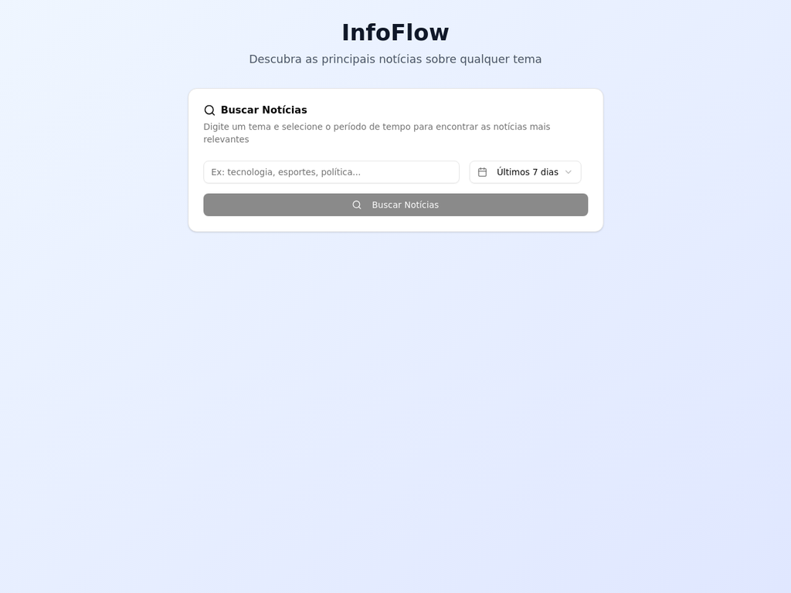
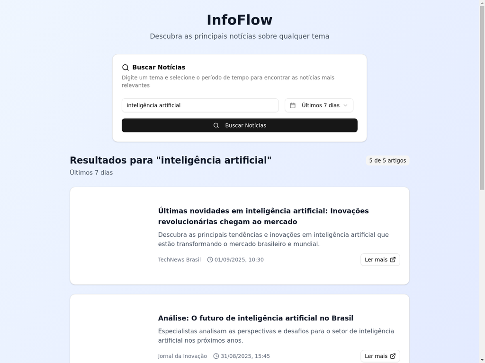
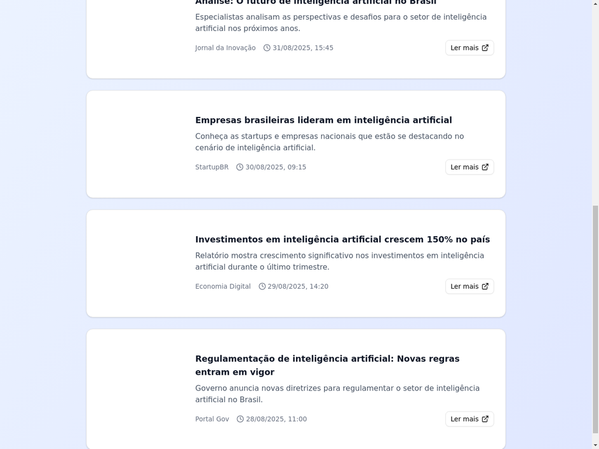

# InfoFlow - Sistema de Notícias em Tempo Real

InfoFlow é um sistema completo para buscar e visualizar notícias sobre qualquer tema, com filtros de tempo personalizáveis. O projeto combina um backend Flask robusto com um frontend React moderno e responsivo.

## 🚀 Funcionalidades

- **Busca por Tema**: Digite qualquer tema e encontre notícias relevantes
- **Filtros de Tempo**: Selecione entre diferentes janelas de tempo:
  - Últimos 7 dias
  - Últimas 4 semanas
  - Últimos 3 meses
  - Último ano
- **Interface Responsiva**: Design moderno que funciona em desktop e mobile
- **API RESTful**: Backend bem estruturado com endpoints documentados
- **Testes Automatizados**: Suite completa de testes para garantir qualidade

## 📸 Screenshots

### Página Inicial


### Resultados de Busca


### Visualização Completa


## 🛠️ Tecnologias Utilizadas

### Backend
- **Flask**: Framework web Python
- **Flask-CORS**: Suporte a requisições cross-origin
- **Requests**: Cliente HTTP para APIs externas
- **GNews API**: Fonte de notícias em tempo real

### Frontend
- **React**: Biblioteca JavaScript para interfaces
- **Vite**: Build tool moderna e rápida
- **Tailwind CSS**: Framework CSS utilitário
- **shadcn/ui**: Componentes UI modernos
- **Lucide Icons**: Ícones elegantes

## 📁 Estrutura do Projeto

```
infoflow/
├── backend/
│   └── infoflow_api/
│       ├── src/
│       │   ├── routes/
│       │   │   ├── news.py      # Rotas da API de notícias
│       │   │   └── user.py      # Rotas de usuário (template)
│       │   ├── models/          # Modelos de dados
│       │   └── main.py          # Aplicação principal Flask
│       ├── venv/                # Ambiente virtual Python
│       ├── requirements.txt     # Dependências Python
│       └── test_api.py         # Testes automatizados
├── frontend/
│   └── infoflow-frontend/
│       ├── src/
│       │   ├── components/      # Componentes React
│       │   ├── App.jsx         # Componente principal
│       │   └── main.jsx        # Ponto de entrada
│       ├── public/             # Arquivos estáticos
│       └── package.json        # Dependências Node.js
└── screenshots/                # Screenshots do sistema
```

## 🚀 Como Executar

### Pré-requisitos
- Python 3.11+
- Node.js 20+
- Chave da API GNews

### Backend (Flask)

1. Navegue para o diretório do backend:
```bash
cd backend/infoflow_api
```

2. Ative o ambiente virtual:

   **Windows (PowerShell):**
   ```powershell
   .\venv\Scripts\activate
   ```
   **Windows (Command Prompt):**
   ```cmd
   venv\Scripts\activate
   ```
   **Linux/macOS:**
   ```bash
   source venv/bin/activate
   ```

3. Configure a chave da API:

   **Windows (PowerShell):**
   ```powershell
   $env:GNEWS_API_KEY="sua_chave_aqui"
   ```
   **Windows (Command Prompt):**
   ```cmd
   set GNEWS_API_KEY="sua_chave_aqui"
   ```
   **Linux/macOS:**
   ```bash
   export GNEWS_API_KEY="sua_chave_aqui"
   ```

4. Execute o servidor:
```bash
python src/main.py
```

O backend estará disponível em `http://localhost:5000`

### Frontend (React)

1. Navegue para o diretório do frontend:
```bash
cd frontend/infoflow-frontend
```

2. Execute o servidor de desenvolvimento:
```bash
pnpm run dev --host
```

O frontend estará disponível em `http://localhost:5173`

## 🧪 Testes

Execute os testes automatizados do backend:

```bash
cd backend/infoflow_api
python test_api.py
```

Os testes cobrem:
- ✅ Health check da API
- ✅ Busca de notícias válida
- ✅ Diferentes janelas de tempo
- ✅ Validação de parâmetros
- ✅ Diferentes temas

## 📡 API Endpoints

### GET /api/news/health
Verifica se o serviço está funcionando.

**Resposta:**
```json
{
  "status": "ok",
  "service": "InfoFlow News API",
  "version": "1.0.0"
}
```

### POST /api/news/search
Busca notícias por tema e janela de tempo.

**Parâmetros:**
```json
{
  "tema": "tecnologia",
  "janela_tempo": "dias",
  "max_articles": 10
}
```

**Resposta:**
```json
{
  "success": true,
  "tema": "tecnologia",
  "janela_tempo": "dias",
  "total_artigos": 5,
  "artigos": [
    {
      "titulo": "Título da notícia",
      "descricao": "Descrição da notícia",
      "url": "https://exemplo.com/noticia",
      "fonte": "Nome da fonte",
      "data_publicacao": "2025-09-01T10:30:00Z",
      "imagem": "https://exemplo.com/imagem.jpg"
    }
  ]
}
```

## 🔧 Configuração da API

O sistema utiliza a GNews API para buscar notícias. Para obter uma chave:

1. Acesse [gnews.io](https://gnews.io)
2. Crie uma conta gratuita
3. Obtenha sua chave da API
4. Configure a variável de ambiente `GNEWS_API_KEY`

## 🎨 Design e UX

- **Design Responsivo**: Funciona perfeitamente em desktop e mobile
- **Interface Intuitiva**: Formulário simples e resultados claros
- **Feedback Visual**: Estados de carregamento e mensagens de erro
- **Acessibilidade**: Componentes acessíveis e navegação por teclado

## 🚀 Deploy

O projeto está preparado para deploy em plataformas como:
- **Vercel** (Frontend)
- **Heroku** (Backend)
- **Railway** (Full-stack)
- **DigitalOcean** (VPS)

## 🤝 Contribuição

1. Faça um fork do projeto
2. Crie uma branch para sua feature (`git checkout -b feature/AmazingFeature`)
3. Commit suas mudanças (`git commit -m 'Add some AmazingFeature'`)
4. Push para a branch (`git push origin feature/AmazingFeature`)
5. Abra um Pull Request

## 📝 Licença

Este projeto está sob a licença MIT. Veja o arquivo `LICENSE` para mais detalhes.

## 👨‍💻 Autor

Desenvolvido com ❤️ por Joao Pedro Aguiar Martins

---

**InfoFlow** - Descubra as principais notícias sobre qualquer tema, a qualquer momento.

